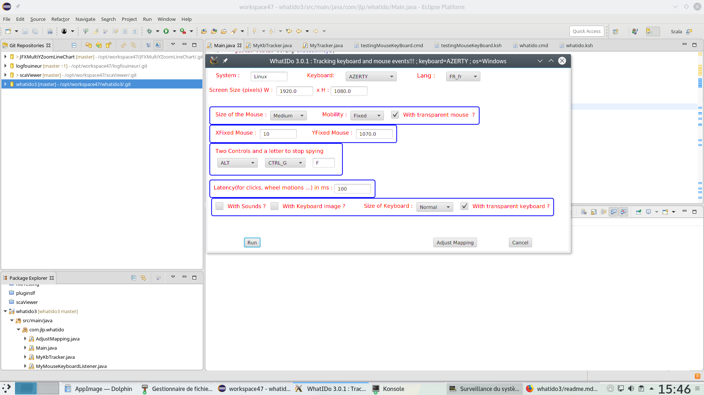
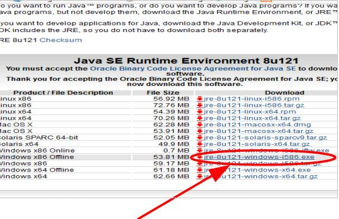
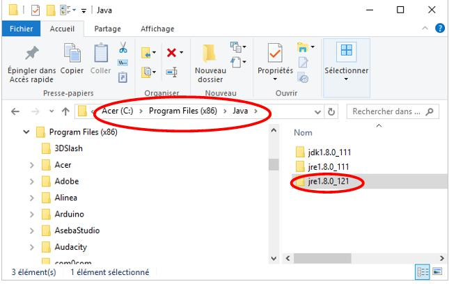

<!DOCTYPE HTML PUBLIC "-//W3C//DTD HTML 4.0 Transitional//EN">
<HTML>
<HEAD>
	<META HTTP-EQUIV="CONTENT-TYPE" CONTENT="text/html; charset=windows-1252">
	<TITLE></TITLE>
	<META NAME="GENERATOR" CONTENT="OpenOffice 4.1.3  (Win32)">
	<META NAME="AUTHOR" CONTENT="Jean-Louis PASTUREL">
	<META NAME="CREATED" CONTENT="20170216;16525459">
	<META NAME="CHANGEDBY" CONTENT="Jean-Louis PASTUREL">
	<META NAME="CHANGED" CONTENT="20170426;15085606">
	<META NAME="CHANGEDBY" CONTENT="Jean-Louis PASTUREL">
	
</HEAD>
<BODY LANG="fr-FR" DIR="LTR">

	
  
	

<H1 ALIGN=CENTER>whatido&nbsp;:Presentation of the
application</H1>
<H2 LANG="en-GB" CLASS="western">General information</H2>

It is a utility that allows you to
see on the screen the actions you do on the mouse (click / right /
left / middle and the actions forward / back on the wheel of the
mouse as well as actions on the keyboard (except numeric keypad).

The
visualization is done through 2 transparent images of the mouse and
the keyboard which remains in window always visible (except for some
contextual menus where Windows is priority, but it is not very
inconvenient). 

 

The
software also works on Linux and certainly also on OS X (not tested
by me on OS X, keyboard mapping to do), see in the appendix of this
document how to realize a complete mapping if this software does not
work correctly with your Micro / OS / keyboard. There may be
deviations from the Windows / AZERTY mapping . 

 

This software is
based on the Library <B>JNativeHook</B>
available at Github site :
<A HREF="https://github.com/kwhat/jnativehook">https://github.com/kwhat/jnativehook</A>

 

The binary code is avaible
on Maven Repo, I use the Version 2.1.0 : 

<A HREF="https://mvnrepository.com/artifact/com.1stleg/jnativehook/2.1.0">https://mvnrepository.com/artifact/com.1stleg/jnativehook/2.1.0</A>

<H2 CLASS="western">An
overview of the product on this document 
</H2>

The
launch screen, which will be explained in detail later in the
document .

  

  

 

An image
of the product in action: 

We
see a blue round on the Print-Screen key when I made the screenshot!

  

You
can choose whether to display the keyboard or not, you can activate
the sound that describes the actions performed on the mouse and
keyboard. There 3 sizes for the image of the Keyboard (
Normal, Medium, Small), usefull for learnig keystroke to beginners.

 

For the
mouse, there are 4 sizes to choose from (Large, Medium, Small, Tiny)
and being mobile for the 3 smallest sizes and being fixed for the 3
largest sizes. 

 

For
mice of the fixed type, the black button in the middle makes it
possible to move it in another part of the screen when it impedes.

<H2 LANG="en-GB" CLASS="western">Use cases of the product 
</H2>

<B>Whatido </B>works
well with video projectors.

Possible
uses are: 

<UL>
	<LI>

	Introduction to computers for the presentation of
	mouse actions and the keyboard 
	

	<LI>

	Live software presentation by viewing all mouse and
	keyboard actions 
	

	<UL>
		<UL>
			<LI>
ex :
			Navigation in file explorer, copying /
			pasting mechanisms, use of office tools ...

		</UL>
	</UL>
	<LI>

	Creation of video tutorials by recording the screen
	with whatido activated. 
	

</UL>

Tip: you can run the product twice: 

<UL>
	<UL>
		<LI>

		Once with a fixed Large or Medium mouse 
		

		<LI>

		The other time with the Tiny / Mobile mouse that
		will follow the Windows cursor during its movements. 
		

	</UL>
</UL>

The two mice will show the actions performed. 

 

Limitation with Powerpoint in Slideshow mode, the
product (mouse image and / or keyboard image) does not appear in the
foreground and can not be used in this case, it is necessary to
remain in editing mode. 

  

<H1 LANG="en-GB">Installation</H1>
<H2 CLASS="western">Prerequisites
</H2>

Whatido requires the presence of a recent Java
Virtual Machine version greater than 1.8.0_121. The 32-bit JRE
version can be installed from the Oracle site: 

<A HREF="http://www.oracle.com/technetwork/java/javase/downloads/jre8-downloads-2133155.html">http://www.oracle.com/technetwork/java/javase/downloads/jre8-downloads-2133155.html</A>

Check the acceptation of the License.

  

Choose the 32-bit version
download (i586)

 After
downloading, it will be necessary to launch the corresponding .exe
file in administrator mode (right click on the file, and choose
launch in administrator mode). The version must be the last
available version on Oracle site.

  

  

Once installed, you should be able to see your JRE as
shown below: 

 

  

<H2 LANG="en-GB" CLASS="western">Installation of Whatido</H2>

The
product is in the form of a zip whatido archive &lt;Version&gt;
Exe.zip ex <B>whatido3Exe.zip</B>
this archive
is available at the root of <A HREF="https://github.com/PASTJL/whatido3">https://github.com/PASTJL/whatido3</A>

 

We assume for the
rest of the installation that there is a C: \opt directory on your
computer, otherwise you will create it or you will adapt the
procedure described below. 

 

<UL>
	<LI>

	Position the
	whatido3Exe.zip archive under C:\opt and unzip 
	

	<LI>

	Open the file
	<B>C:\opt\whatido\script\whatido.cmd</B>
	and adapt paths to
	red 
	

</UL>

Set
PROJECT_HOME=<B>C:\opt\whatido</B>

Set
CLASSPATH=%PROJECT_HOME%\lib\jnativehook-2.1.0.jar;.;%PROJECT_HOME%\lib\whatido-3.0.0.jar;

Set
JAVA_HOME=C:\Program Files (x86)\Java\<B>jre1.8.0_121</B>\bin

start &quot;&quot;
&quot;%JAVA_HOME%\javaw&quot; -Droot=%PROJECT_HOME%
-Dhome=%PROJECT_HOME% -cp %CLASSPATH% com.jlp.whatido.Main 

Exit

<UL>
	<LI>

	Open the file <B>C:\
	opt\whatido\script\testingMouseKeyBoard.cmd</B> and
	adapt paths to red 
	

</UL>

Set
PROJECT_HOME=<B>C:\opt\whatido</B>

Set
CLASSPATH=%PROJECT_HOME%\lib\jnativehook-2.1.0.jar;.;%PROJECT_HOME%\lib\whatido-3.0.0.jar;

Set
JAVA_HOME=C:\Program Files (x86)\Java\<B>jre1.8.0_121</B>\bin

&quot;%JAVA_HOME%\java&quot;
-Droot=%PROJECT_HOME% -Dhome=%PROJECT_HOME% -cp %CLASSPATH%
com.jlp.whatido.MyMouseKeyboardListener 

<UL>
	<LI>

	Make
	a shortcut on the desktop for the file
	<B>C:\opt\whatido\script\whatido.cmd</B> 
	

	<LI>

	An
	 icon  <B>whatidoIco.ico</B>
	 is available in the folder  <B>C:\opt\whatido\script\</B>
	to decorate the shortcut.

	<LI>

	Click
	on the shortcut to launch <B>whatido.</B>
	
	

</UL>

  

</BODY>
</HTML>