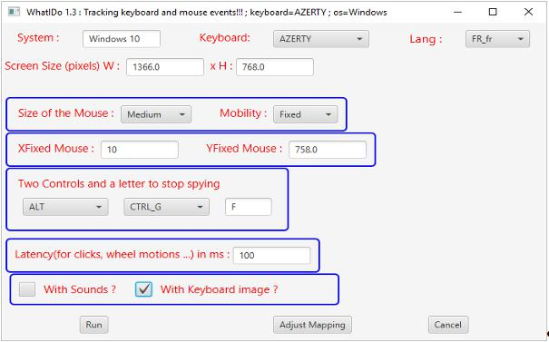

<!DOCTYPE HTML PUBLIC "-//W3C//DTD HTML 4.0 Transitional//EN">
<HTML>
<HEAD>
	<META HTTP-EQUIV="CONTENT-TYPE" CONTENT="text/html; charset=windows-1252">
	<TITLE></TITLE>
	<META NAME="GENERATOR" CONTENT="OpenOffice 4.1.3  (Win32)">
	<META NAME="AUTHOR" CONTENT="Jean-Louis PASTUREL">
	<META NAME="CREATED" CONTENT="20170408;9383251">
	<META NAME="CHANGEDBY" CONTENT="Jean-Louis PASTUREL">
	<META NAME="CHANGED" CONTENT="20170408;13422045">
	<META NAME="CHANGEDBY" CONTENT="Jean-Louis PASTUREL">
	
</HEAD>
<BODY LANG="en-GB" DIR="LTR">
<H1 LANG="fr-FR" STYLE="page-break-before: always">Whatido&nbsp;:
Pr&eacute;sentation du produit</H1>
<H2 LANG="fr-FR" CLASS="western">G&eacute;n&eacute;ralit&eacute;s</H2>

Il s'agit d'un utilitaire qui permet de visualiser
sur l'&eacute;cran, les actions que l'on fait sur la souris ( clic /
droit/gauche/milieu et les actions avant / arri&egrave;re sur la
roulettes) ainsi que les actions sur le clavier ( hors pav&eacute;
num&eacute;rique).

La visualisation se fait &agrave; travers 2 images
transparentes de la souris et du clavier qui reste en fen&ecirc;tre
toujours visible ( sauf pour quelques menus contextuel o&ugrave;
Windows est prioritaire, mais ce n'est pas tr&egrave;s g&ecirc;nant).

Le logiciel fonctionne aussi sur Linux et &agrave;
priori aussi sur OS X ( non test&eacute; par moi sur OS X, mapping du
clavier &agrave; faire), voir dans les annexes de ce document comment
r&eacute;aliser un mapping complet si ce logiciel ne fonctionne pas
correctement avec votre micro/os/clavier. Il se peut qu'il y ait des
&eacute;carts avec le mapping Windows/AZERTY .

<H2 CLASS="western">Un aper&ccedil;u du produit sur ce document</H2>

L'&eacute;cran de lancement qui sera expliqu&eacute; en d&eacute;tail
plus loin dans le document.

  

Une image du produit en action&nbsp;:

On voit un rond bleu sur la touche Print-Screen quand
j'ai fait la copie d'&eacute;cran&nbsp;!

On peut choisir l'affichage ou non du clavier,
on peut activer le son qui d&eacute;crit les actions faites sur la
souris et le clavier.

Pour ce qui concerne la souris, on a 4 tailles au
choix ( Large, Medium, Small, Tiny) et le fait d&rsquo;&ecirc;tre
mobile pour les 3 plus petites tailles et d'&ecirc;tre fixe pour les
3 plus grandes tailles.

Pour les souris de type fixe, le bouton noir au
milieu permet de la d&eacute;placer dans une autre partie de l'&eacute;cran
quand elle g&egrave;ne.

<H2 CLASS="western">Exemples d'utilisation du produit</H2>

<B>Whatido </B>fonctionne correctement avec des vid&eacute;o-projecteurs.

Les utilisations possibles sont :

<UL>
	<LI>
initiation &agrave; l'informatique pour la pr&eacute;sentation
	des actions souris et le clavier

	<LI>
pr&eacute;sentation en direct de logiciel en visualisant
	toutes les actions souris et clavier

	<UL>
		<UL>
			<LI>
ex : navigation dans l'explorateur de fichier, m&eacute;canismes
			du copier/coller, utilisation des outils bureautiques ...

		</UL>
	</UL>
	<LI>
cr&eacute;ation de tutoriels vid&eacute;o par enregistrement
	de l'&eacute;cran avec <B>whatido</B> activ&eacute;.

</UL>

Astuce : on peut lancer 2 fois le produit :

<UL>
	<UL>
		<LI>
une fois avec une souris fixe de taille Large ou M&eacute;dium

		<LI>
l'autre fois avec la souris Tiny/Mobile qui va suivre le
		curseur Windows au cours de ses d&eacute;placements. 
		

	</UL>
</UL>

Les 2 souris montreront les actions faites.

Limitation avec <B>Powerpoint</B> en mode Diaporama, le produit
(image souris et/ou image clavier) n&rsquo;appara&icirc;t pas en
premier plan et ne peut &ecirc;tre utiliser dans ce cas, il faut
rester en mode &eacute;dition.

<H1>Installation</H1>
<H2 CLASS="western">Pr&eacute;-requis</H2>

<B>Whatido</B> n&eacute;cessite la pr&eacute;sence d'une machine
virtuelle <B>Java </B>r&eacute;cente version sup&eacute;rieure &agrave;
<B>1.8.0_121</B>.

On pourra installer la version <B>JRE 32 bits</B> depuis le site
de <B>Oracle</B>&nbsp;:

<A HREF="http://www.oracle.com/technetwork/java/javase/downloads/jre8-downloads-2133155.html">http://www.oracle.com/technetwork/java/javase/downloads/jre8-downloads-2133155.html</A>

Cocher l'acceptation de licence.

Choisir le t&eacute;l&eacute;chargement de la
version 32 bits ( i586) 

Apr&egrave;s t&eacute;l&eacute;chargement, il
faudra lancer le <B>fichier .exe
correspondant en mode administrateur</B> (
clic droit sur le fichier, et choisir lancement en mode
administrateur).

Une fois install&eacute;, vous devez pouvoir
voir votre JRE comme montr&eacute; ci-dessous&nbsp;:

  

<H2 CLASS="western">Installation de Whatido</H2>

Le produit se pr&eacute;sente sous la forme d'une archive zip
<B>whatido&lt;Version&gt;Exe.zip</B> ex <B>whatido3Exe.zip </B>.

On va supposer pour la suite de
l'installation qu'il existe un r&eacute;pertoire <B>C:\opt</B>
sur votre ordinateur, sinon vous le
cr&eacute;ez ou bien vous adapterez la proc&eacute;dure d&eacute;crite
ci-dessous.

<UL>
	<LI>
Positionner l'archive
	<B>whatido3Exe.zip</B> sous
	<B>C:\opt</B> et d&eacute;zipper

	<LI>
Ouvrir le fichier
	C:\opt\whatido\script\<B>whatido.cmd</B> et
	adapter les chemins en rouge 
	

</UL>

Set
PROJECT_HOME=<B>C:\opt\whatido</B>

Set
CLASSPATH=%PROJECT_HOME%\lib\jnativehook-2.1.0.jar;.;%PROJECT_HOME%\lib\whatido-3.0.0.jar;

Set
JAVA_HOME=C:\Program Files (x86)\Java\<B>jre1.8.0_121</B>\bin

start &quot;&quot;
&quot;%JAVA_HOME%\javaw&quot; -Droot=%PROJECT_HOME%
-Dhome=%PROJECT_HOME% -cp %CLASSPATH% com.jlp.whatido.Main 

Exit

<UL>
	<LI>
Ouvrir le fichier
	C:\opt\whatido\script\<B>testingMouseKeyBoard.cmd</B> et
	adapter les chemins en rouge 
	

</UL>

Set
PROJECT_HOME=<B>C:\opt\whatido</B>

Set
CLASSPATH=%PROJECT_HOME%\lib\jnativehook-2.1.0.jar;.;%PROJECT_HOME%\lib\whatido-3.0.0.jar;

Set
JAVA_HOME=C:\Program Files (x86)\Java\<B>jre1.8.0_121</B>\bin

&quot;%JAVA_HOME%\java&quot;
-Droot=%PROJECT_HOME% -Dhome=%PROJECT_HOME% -cp %CLASSPATH%
com.jlp.whatido.MyMouseKeyboardListener 

<UL>
	<LI>
Faire
	un raccourci sur le bureau pour le fichier
	C:\opt\whatido\script\<B>whatido.cmd</B>

	<LI>
Cliquer
	sur le raccourci pour lancer <B>whatido.</B>

</UL>

  

</BODY>
</HTML>