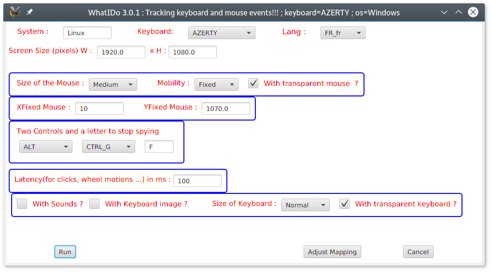

<!DOCTYPE HTML PUBLIC "-//W3C//DTD HTML 4.0 Transitional//EN">
<html>
<head>
	<meta http-equiv="content-type" content="text/html; charset=utf-8"/>
	<title></title>
	<meta name="generator" content="LibreOffice 5.4.5.1 (Linux)"/>
	<meta name="author" content="Jean-Louis PASTUREL"/>
	<meta name="created" content="2017-04-08T00:00:00.009383251"/>
	<meta name="changed" content="2018-03-28T08:35:51.282826049"/>
	
</head>
<body lang="en-GB" dir="ltr">
<h1 lang="fr-FR" style="page-break-before: always">Whatido&nbsp;:
Présentation du produit</h1>
<h2 lang="fr-FR" class="western">Généralités</h2>

Il s'agit d'un utilitaire qui permet de visualiser
sur l'écran, les actions que l'on fait sur la souris ( clic /
droit/gauche/milieu et les actions avant / arrière sur la roulettes)
ainsi que les actions sur le clavier ( hors pavé numérique).

La visualisation se fait à travers 2 images
transparentes de la souris et du clavier qui reste en fenêtre
toujours visible ( sauf pour quelques menus contextuel où Windows
est prioritaire, mais ce n'est pas très gênant).

Le logiciel fonctionne aussi sur Linux et à priori
aussi sur OS X ( non testé par moi sur OS X, mapping du clavier à
faire), voir dans les annexes de ce document comment réaliser un
mapping complet si ce logiciel ne fonctionne pas correctement avec
votre micro/os/clavier. Il se peut qu'il y ait des écarts avec le
mapping Windows/AZERTY .

Cette application est basée sur la
Bibliothèque <b>JNativeHook</b> disponible sur le site Github :
<a href="https://github.com/kwhat/jnativehook">https://github.com/kwhat/jnativehook</a>

 

Le code binaire est disponible dans le
dépot Maven , j'ai utilisé la Version 2.1.0 : 

<a href="https://mvnrepository.com/artifact/com.1stleg/jnativehook/2.1.0">https://mvnrepository.com/artifact/com.1stleg/jnativehook/2.1.0</a>

Une vidéo montrant whatido au travail :
<a href="https://youtu.be/UVeElF26KB8">https://youtu.be/UVeElF26KB8</a>

<h2 class="western">Un aperçu du produit sur ce document</h2>

L'écran de lancement qui sera expliqué en détail plus loin dans
le document.

 
 

Une image du produit en action&nbsp;:

On voit un rond bleu sur la touche Print-Screen quand
j'ai fait la copie d'écran&nbsp;!

On peut choisir l'affichage ou non du clavier, on
peut activer le son qui décrit les actions faites sur la souris et
le clavier. Pour le clavier on dispose de 3 tailles ( Normal, Medium,
Small), utile pour l'apprentissage du clavier aux débutants .

Pour ce qui concerne la souris, on a 4 tailles au
choix ( Large, Medium, Small, Tiny) et le fait d’être mobile pour
les 3 plus petites tailles et d'être fixe pour les 3 plus grandes
tailles.

Pour les souris de type fixe, le bouton noir au
milieu permet de la déplacer dans une autre partie de l'écran quand
elle gène.

<h2 class="western">Exemples d'utilisation du produit</h2>

<b>Whatido </b>fonctionne correctement avec des vidéo-projecteurs.

Les utilisations possibles sont :

<ul>
	<li/>

initiation à l'informatique pour la présentation des
	actions souris et le clavier

	<li/>

présentation en direct de logiciel en visualisant toutes
	les actions souris et clavier

	<ul>
		<ul>
			<li/>

ex : navigation dans l'explorateur de fichier, mécanismes
			du copier/coller, utilisation des outils bureautiques ...

		</ul>
	</ul>
	<li/>

création de tutoriels vidéo par enregistrement de l'écran
	avec <b>whatido</b> activé.

</ul>

Astuce : on peut lancer 2 fois le produit :

<ul>
	<ul>
		<li/>

une fois avec une souris fixe de taille Large ou Médium

		<li/>

l'autre fois avec la souris Tiny/Mobile qui va suivre le
		curseur Windows au cours de ses déplacements. 
		

	</ul>
</ul>

Les 2 souris montreront les actions faites.

Limitation avec <b>Powerpoint</b> en mode Diaporama, le produit
(image souris et/ou image clavier) n’apparaît pas en premier plan
et ne peut être utiliser dans ce cas, il faut rester en mode
édition.

<h1>Installation</h1>
<h2 class="western">Pré-requis</h2>

<b>Whatido</b> nécessite la présence d'une machine virtuelle
<b>Java </b>récente version supérieure à <b>1.8.0_121</b>.

On pourra installer la version <b>JRE 32 bits</b> depuis le site
de <b>Oracle</b>&nbsp;:

<a href="http://www.oracle.com/technetwork/java/javase/downloads/jre8-downloads-2133155.html">http://www.oracle.com/technetwork/java/javase/downloads/jre8-downloads-2133155.html</a>

 
 

Cocher l'acceptation de licence.

Choisir le téléchargement de la version 32 bits (
i586) . La version à télécharger sur le site de Oracle doit être
la plus récente.

Après téléchargement, il faudra lancer le
<b>fichier .exe correspondant en mode
administrateur</b> ( clic droit sur le
fichier, et choisir lancement en mode administrateur).

Une fois installé, vous devez pouvoir voir votre JRE
comme montré ci-dessous&nbsp;:

 
 

<h2 class="western">Installation de Whatido</h2>

Le produit se présente sous la forme d'une archive zip
<b>whatido&lt;Version&gt;Exe.zip</b> ex <b>whatido3Exe.zip </b>.
Une archive au format zip est disponible sous la racine de :

<a href="https://github.com/PASTJL/whatido3">https://github.com/PASTJL/whatido3</a>

On va supposer pour la suite de
l'installation qu'il existe un répertoire <b>C:\opt</b> sur
votre ordinateur, sinon vous le créez ou bien vous adapterez la
procédure décrite ci-dessous.

<ul>
	<li/>

Positionner l'archive
	<b>whatido3Exe.zip</b> sous
	<b>C:\opt</b> et dézipper

	<li/>

Ouvrir le fichier
	C:\opt\whatido\script\<b>whatido.cmd</b> et
	adapter les chemins en rouge 
	

</ul>

Set
PROJECT_HOME=<b>C:\opt\whatido</b>

Set
CLASSPATH=%PROJECT_HOME%\lib\jnativehook-2.1.0.jar;.;%PROJECT_HOME%\lib\whatido-3.0.0.jar;

Set
JAVA_HOME=C:\Program Files (x86)\Java\<b>jre1.8.0_121</b>\bin

start
&quot;&quot; &quot;%JAVA_HOME%\javaw&quot; -Droot=%PROJECT_HOME%
-Dhome=%PROJECT_HOME% -cp %CLASSPATH% com.jlp.whatido.Main 

Exit

<ul>
	<li/>

Ouvrir le fichier
	C:\opt\whatido\script\<b>testingMouseKeyBoard.cmd</b> et
	adapter les chemins en rouge 
	

</ul>

Set
PROJECT_HOME=<b>C:\opt\whatido</b>

Set
CLASSPATH=%PROJECT_HOME%\lib\jnativehook-2.1.0.jar;.;%PROJECT_HOME%\lib\whatido-3.0.0.jar;

Set
JAVA_HOME=C:\Program Files (x86)\Java\<b>jre1.8.0_121</b>\bin

&quot;%JAVA_HOME%\java&quot;
-Droot=%PROJECT_HOME% -Dhome=%PROJECT_HOME% -cp %CLASSPATH%
com.jlp.whatido.MyMouseKeyboardListener 

<ul>
	<li/>

Faire
	un raccourci sur le bureau pour le fichier
	C:\opt\whatido\script\<b>whatido.cmd</b>

	<li/>

Une
	icône <b>whatidoIco.ico</b> est fournie dans le répertoire
	<b>C:\opt\whatido\script\ </b>pour illustrer le raccourci.

	<li/>

Cliquer
	sur le raccourci pour lancer <b>whatido.</b>

</ul>

 
 

</body>
</html>